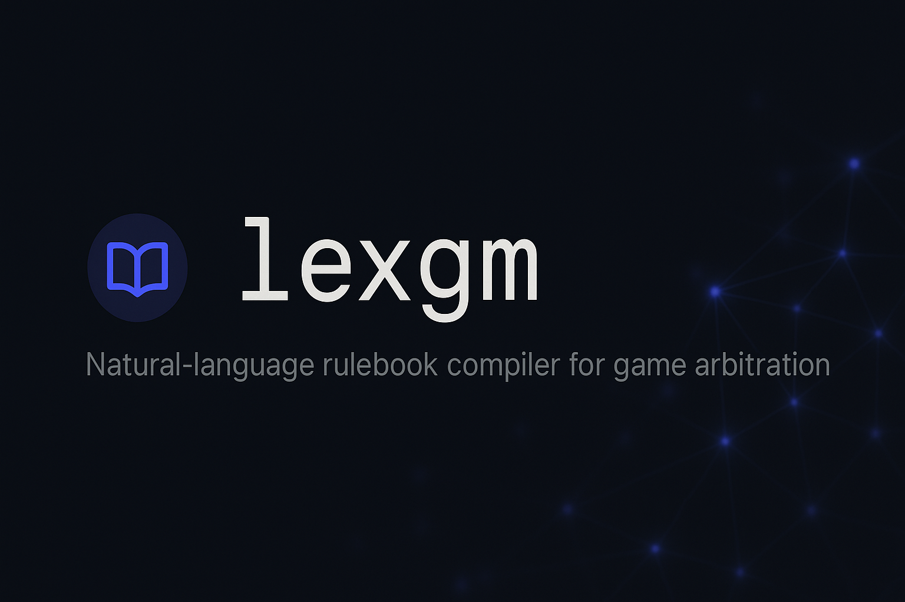
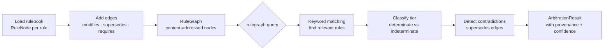

# rulegraph

**Natural-language rulebook compiler for game arbitration.**



[](https://github.com/sandeep-alluru/rulegraph/actions/workflows/ci.yml)
[](https://pypi.org/project/rulegraph/)
[](https://pypi.org/project/rulegraph/)
[](https://pypi.org/project/rulegraph/)
[](LICENSE)
[](https://codecov.io/gh/sandeep-alluru/rulegraph)
[](https://mypy-lang.org/)

[Quick Start](#quick-start) · [How It Works](#how-it-works) · [CLI Reference](#cli-reference) · [MCP / Claude](#mcp--claude) · [OpenAI](#openai-tools) · [vs. Alternatives](#vs-alternatives) · [Contributing](CONTRIBUTING.md)

---

## Why

Game rulebooks contain two fundamentally different types of rules:

- **Determinate rules** — "Roll d20 + modifier ≥ AC → hit." The answer is always the same.
- **Indeterminate rules** — "Interpret difficult terrain in an unusual environment." The GM must decide.

Most rule-lookup tools treat all rules the same. rulegraph doesn't. It classifies every rule, represents relationships as a typed graph, detects contradictions between errata and source material, and returns structured arbitration results with full provenance.

```bash
rulegraph add-rule PHB.attack "When you make an attack roll..." --type mechanic --tag combat
rulegraph add-edge UA.flanking PHB.attack modifies
rulegraph query "How do I make an attack roll?"
# => tier: determinate | confidence: 95% | provenance: [PHB.attack, UA.flanking]
```

---

## How It Works



**Core primitives:**

- **RuleNode** — a single rule, content-addressed by `rule_id`. Carries `node_type`, `tags`, `source`, and `confidence`.
- **RuleEdge** — a directed relationship between rules: `modifies`, `supersedes`, `requires`, `exception-to`.
- **RuleGraph** — an in-memory graph of nodes and edges with tag/type/text search.
- **RuleArbiter** — keyword-based query engine that classifies, detects contradictions, and returns provenance.
- **ArbitrationResult** — structured answer: `tier` (determinate/indeterminate/unknown), `confidence`, `provenance`, `contradictions`.
- **RuleStore** — SQLite-backed persistence for nodes, edges, and results.

---

## Features

| Feature | Description |
|---------|-------------|
| Content-addressed IDs | `SHA-256[:16]` of `rule_id` — same rule always same ID |
| Rule classification | `determinate` / `indeterminate` / `unknown` per query |
| Provenance | Every answer cites the exact rules used |
| Contradiction detection | Flags `supersedes` and `exception-to` conflicts |
| Edge types | `modifies`, `supersedes`, `requires`, `exception-to` |
| SQLite persistence | `RuleStore` saves nodes, edges, and results |
| FastAPI REST | Full API with `/rule`, `/edge`, `/query`, `/rules`, `/results` |
| MCP server | Three tools: `add_rule`, `query_rules`, `arbitrate` |
| Rich CLI | Colour-coded output with tables and panels |

---

## Quick Start

```bash
pip install rulegraph
# or with API server:
pip install "rulegraph[api]"
```

```bash
# Add rules
rulegraph add-rule PHB.attack "Roll d20 + modifier. If result >= AC, attack hits." \
    --type mechanic --tag combat --tag attack

rulegraph add-rule PHB.difficult "Difficult terrain costs 1 extra foot per foot moved." \
    --type narrative --tag movement

# Add an edge (UA flanking modifies PHB attack roll)
rulegraph add-edge UA.flanking PHB.attack modifies --condition "when flanking"

# Query
rulegraph query "How do I make an attack roll?"
rulegraph query "What is difficult terrain?"

# List rules
rulegraph rules
rulegraph rules --tag combat

# Status
rulegraph status
```

---

## CLI Reference

| Command | Description |
|---------|-------------|
| `rulegraph add-rule RULE_ID TEXT` | Add a rule node |
| `rulegraph add-edge SOURCE TARGET RELATION` | Add a rule edge |
| `rulegraph query QUESTION` | Arbitrate a question |
| `rulegraph rules [--tag TAG]` | List rules |
| `rulegraph status` | Show DB statistics |

**Options (all commands):**

| Flag | Description |
|------|-------------|
| `--db PATH` | Path to SQLite database (default: `.rulegraph/rules.db`) |
| `--type TYPE` | Node type for `add-rule` (default: `mechanic`) |
| `--tag TAG` | Add tag to rule (repeatable) |
| `--format json\|rich` | Output format (default: `rich`) |

---

## MCP / Claude

rulegraph ships an MCP server exposing three tools:

```json
{
  "mcpServers": {
    "rulegraph": {
      "command": "rulegraph-mcp"
    }
  }
}
```

| Tool | Description |
|------|-------------|
| `add_rule` | Add a rule node to the graph |
| `query_rules` | Arbitrate a question |
| `arbitrate` | Return a structured ArbitrationResult |

Install the MCP extras: `pip install "rulegraph[mcp]"`

See [docs/mcp.md](docs/mcp.md) for full setup instructions.

---

## OpenAI Tools

Tools are also available in OpenAI function-calling format at `tools/openai-tools.json`. See [docs/openai.md](docs/openai.md) or reference via the Codex CLI.

```bash
cat tools/openai-tools.json | jq '.[].function.name'
# => "add_rule", "query_rules", "arbitrate"
```

---

## vs. Alternatives

| Tool | Tier classification | Provenance | Contradiction detection | Graph structure |
|------|--------------------|-----------|-----------------------|----------------|
| **rulegraph** | Yes | Full | Yes | Yes |
| Rule lookup scripts | No | No | No | No |
| Vector search | No | Partial | No | No |
| LLM alone | Sometimes | No | Rarely | No |

---

## Repo Structure

```
rulegraph/
├── src/rulegraph/
│   ├── rule.py          # RuleNode, RuleEdge, RuleGraph, RuleStore, RuleArbiter
│   ├── report.py        # Rich, JSON, Markdown formatters
│   ├── cli.py           # Click CLI
│   ├── api.py           # FastAPI server
│   └── mcp_server.py    # MCP server
├── tests/
│   ├── test_rule.py
│   ├── test_graph.py
│   ├── test_store.py
│   ├── test_arbiter.py
│   ├── test_report.py
│   ├── test_cli_runner.py
│   └── test_api.py
├── examples/demo.py
├── smoke_test.py
└── pyproject.toml
```

---

## Topics

#llm #agents #gaming #game-master #rulebook #arbitration #mcp #llmops #nlp

## Star History

[](https://star-history.com/#sandeep-alluru/rulegraph&Date)

---

## 129 tests · Coverage >= 87%

*Find rulegraph on [Smithery](https://smithery.ai/) for MCP server discovery.*
